# Snowflake Intelligence E2E Lab with Cortex Code CLI

Build a complete Snowflake Agent for a retail Sales Analyst — step by step, starting from raw files — using **Cortex Code CLI (CoCo)** as your AI-powered assistant throughout.

---

## What this lab is about

You start with nothing but a set of raw files: **CSV files** with sales and customer data, **PDF documents** with product specifications, and **Images** of products — all from a fictional retail shop selling Snow and Bike equipment.

By the end of the lab you will have built a fully functional **Snowflake Agent** (powered by Snowflake Intelligence) that a Sales Analyst can use to:
- Answer product specification questions
- Analyse sales data across product lines
- Dig into customer feedback and issues
- Compare performance between Snow and Bike products
- Send email summaries on demand

All lab source files are stored in this repository:
**https://github.com/ccarrero-sf/si_e2e_with_coco_files**

---

## Prerequisites

- A Snowflake account with `ACCOUNTADMIN` (or sufficient) privileges
- The `SNOWFLAKE.CORTEX_USER` database role granted to your user
- Network access to your Snowflake server
- A terminal (bash, zsh, or fish on macOS/Linux; PowerShell or WSL on Windows)

---

## Step 0 — Install Cortex Code CLI

### macOS / Linux / WSL

```bash
curl -LsS https://ai.snowflake.com/static/cc-scripts/install.sh | sh
```

The `cortex` executable is installed to `~/.local/bin` and added to your `PATH` automatically.

### Windows (PowerShell)

```powershell
irm https://ai.snowflake.com/static/cc-scripts/install.ps1 | iex
```

The executable is installed to `%LOCALAPPDATA%\cortex` and added to your `PATH` automatically.

### Verify the installation

```bash
cortex --version
```

### Connect to Snowflake

Run `cortex` and follow the setup wizard. It will ask you to:
1. Choose an existing connection from `~/.snowflake/connections.toml` (reuse your Snowflake CLI connection if you have one), **or**
2. Create a new connection by entering your account identifier, username, and authentication method (browser SSO or programmatic access token).

---

## Running the lab

Once CoCo CLI is installed and connected, open a terminal and type:

```bash
cortex
```

Then run each of the 4 steps below in order. **Copy and paste each step prompt directly into the CoCo CLI prompt.** CoCo will plan, write, and execute all the necessary SQL, scripts, and configurations for you.

---

## STEP 1 — Environment Setup, Git Integration & Data Ingestion

Paste the following prompt into CoCo:

> First we want to create or replace a new database, leverage the snowflake GIT integration to get access to some files and copy the files so we can leverage them later. These are the steps to follow. Create a plan:
>
> **Setup**
> The database where everything will be stored will be called CC_CoCo_SNOWFLAKE_INTELLIGENCE_E2E
> We need to create specific roles for bike (BIKE_ROKE) and snow (SNOW_ROLE) users, as they will have access to different type of documents and data. Create one demo user for each of those roles
> Those roles will have access to the COMPUTE_WH warehouse and to the database we have just created.
> Grant those roles to the current user.
>
> **Git Integration**
> Leverage Snoflake GIT integration to clone the repository https://github.com/ccarrero-sf/si_e2e_with_coco_files in the database just created. There you have all the source files that we will be ingesting. Create the GIT integration and the repository if needed.
>
> **Data ingestion**
> Create a stage area where the CSV files that contain structured data should be uploaded
> Create another stage area for the local PDF and Image files should be uploaded
> Stages should be using Snowflake SSE encryption
> Copy the files from the GIT repository into those stage areas.
>
> Everything should be scripted so we can reproduce it anytime. Enumerate it.. The database should be re-created every time we run it.
>
> Once you have created all the scripts needed, run them and check they are ok. Correct any failure.
>
> Create a README file with the steps you took here and save the plan.

### What CoCo produces

CoCo will generate and execute all the SQL scripts, create the database, roles, users, Git integration, and stage areas. Below is an example of CoCo's terminal output at the end of this step:

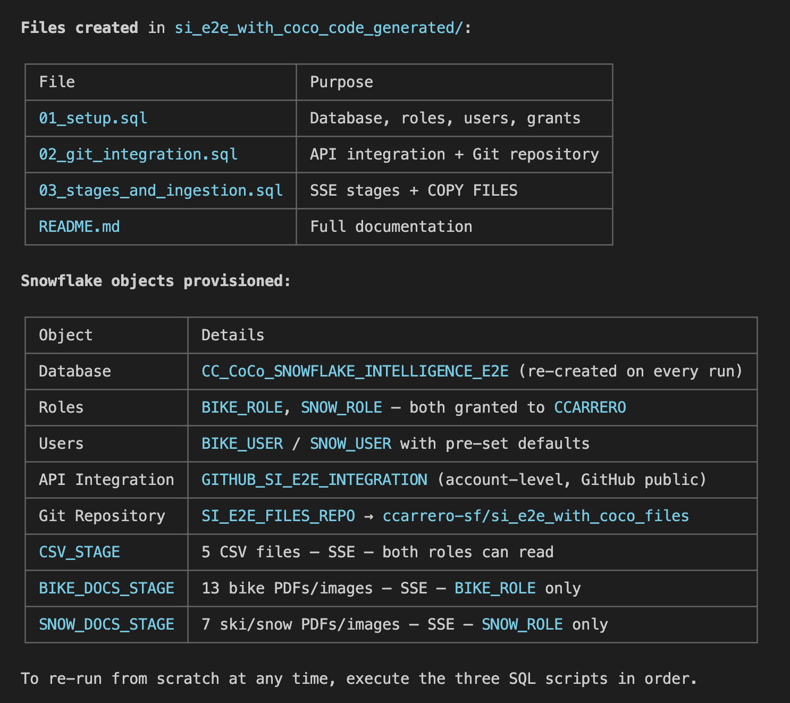

### Snowsight at the end of Step 1

After Step 1 completes, your Snowflake account will look like this in Snowsight:

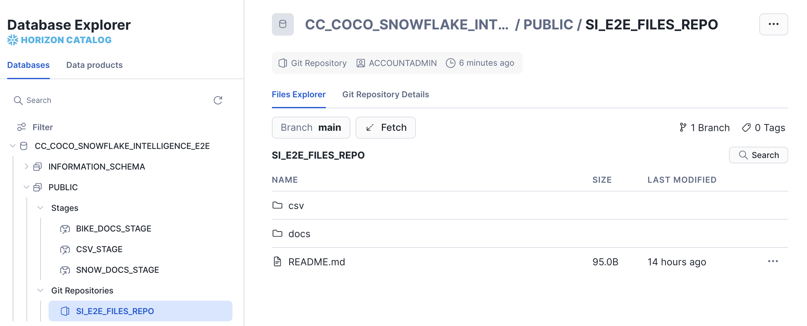

---

## STEP 2 — PDF & Image Processing and Cortex Search Service

Paste the following prompt into CoCo:

> We want to process the PDF and Image files that have just been copied into Snowflake, process them and create a Cortex Search Service. These are the steps to follow. Create a plan:
>
> **Data Processing - PDF Files**
> Once the PDF files have been copied into the stage area, parse them into a table and split them in pieces for a RAG implementation. Leverage native Snowflake PDF processing capabilities with AI_PARSE_DOCUMENT and SPLIT_TEXT_RECURSIVE_CHARACTER Cortex functions.  Also leverage Snowflake AI functions so we can detect if the file is for Bikes or Snow products. You can use the file name and just the first chunk of text for that. There should be a column with that identification for each chunk we have extracted from that file.
>
> **Data Processing - Image files**
> Now process the Image files. In the same table where we have stored the chunks of the PDF files, for each Image we have we should have a description of the image that we should extract using the AI_COMPLETE function and the claude-3-7-sonnet model.
> In the same way you have classified the PDF documents, we need to classify the images to detect if they are for Snow or for Bike products.
> The file names are important as they content the article for the picture.
> In the table where we have chunk the PDF files and added the description of the image files, we need to create a Cortex Search Services using the snowflake-arctic-embed-l-v2.0 embedding model and with a lag of 1 day. This is what each service will create:
> DOCUMENATION_TOOL service. Will include all PDF and Image chunks
>
> Check the documentation of the different AI Functions you are going to be using to make sure you leverage the correct syntax.
>
> For multi-step AI pipelines, include a post-insert sanity checks:
>
> Once you have created all the scripts needed, run them and check they are ok. Correct any failure.
>
> Create a README file with the steps you took here and save the plan.

### What CoCo produces

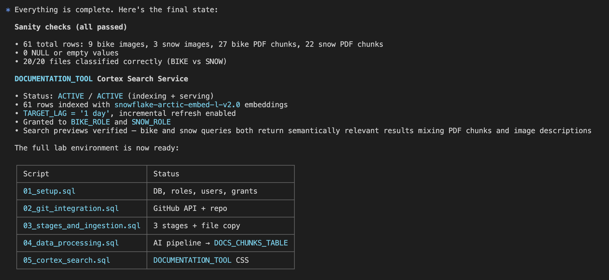

### Snowsight at the end of Step 2

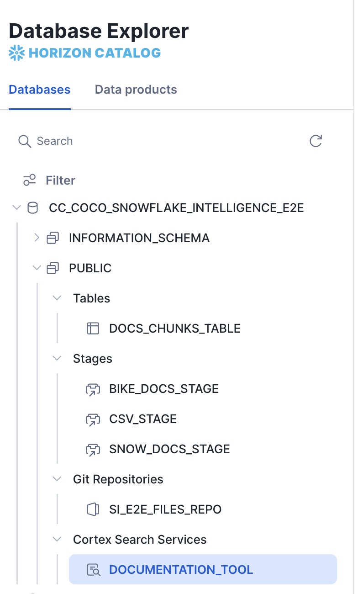

### Cortex Search Service

Once the service is created you can test it directly in Snowsight. Here is an example of the `DOCUMENTATION_TOOL` Cortex Search Service returning results from both PDF and Image chunks:

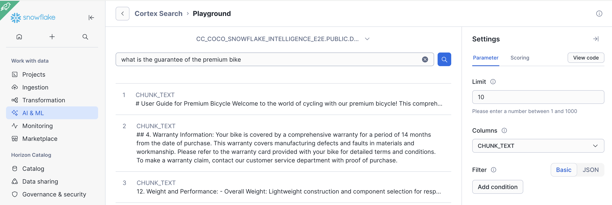

---

## STEP 3 — Structured Data Tables, Row Access Policies & Semantic View

Paste the following prompt into CoCo:

> Now we want to create Snowflake Tables based on the CSV files and create a Semantic View that will be used by Cortex Analyst later.  We also want to create row access policies on those new Snowflake Tables. These are the steps:
>
> The CSV files that have been uploaded should be used to create Snowflake tables with that content.
> We want to be able to search on the customer feedback that we have. Create a Cortex Search Service on that table so we can use it later with our agent.
> Security is important, so we want to enforce row access policies on the Snowflake tables. The BIKE role should only have access to the rows with bike products and the SNOW role should only have access to the rows with snow products. This only applies to sales data. Enforce it.
> Define a Semantic View on the Snowflake tables we have so it will be used later with one Snowflake Agent. The semantic view should include some business logic and terminology. One of the CSV files had examples of questions we wanted to ask.
>
> Once you have created all the scripts needed (create new files if needed), run them and check they are ok. Correct any failure.
>
> Create a README file with the steps you took here and save the plan.

### What CoCo produces

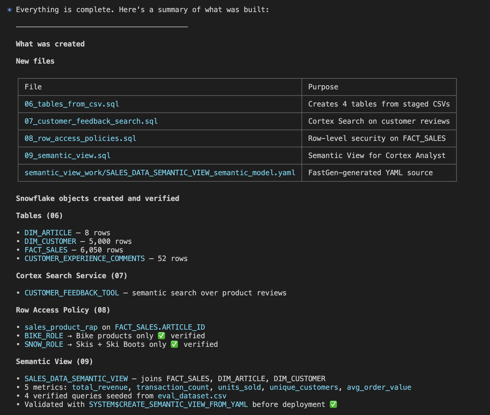

### Snowsight at the end of Step 3

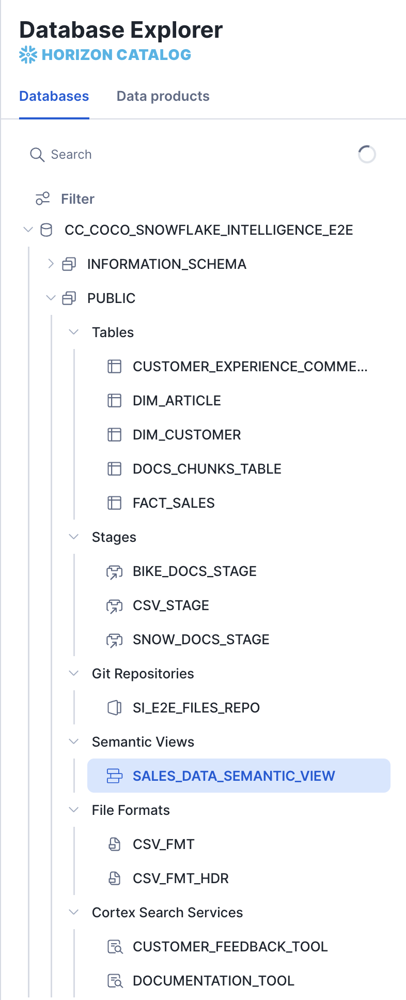

---

## STEP 4 — Build the Snowflake Intelligence Agent

Paste the following prompt into CoCo:

> Now build one Snowflake Agent that will leverage the Cortex Search Tools and the Semantic View that we have created in previous steps. The Agent is a Sales Expert for this retailer company. Should be able to respond to product specification questions and sales about those products. It should be able to also dig into customer issues and understand differences in sales between products.
>
> The Agent should also finish asking if a summary should be sent by email and have a tool to send it.
>
> The Agent will be used with Snowflake Intelligence.
>
> Again, create a  new script with those steps and check it runs ok.
>
> Create a README file with the steps you took here and save the plan.

### What CoCo produces

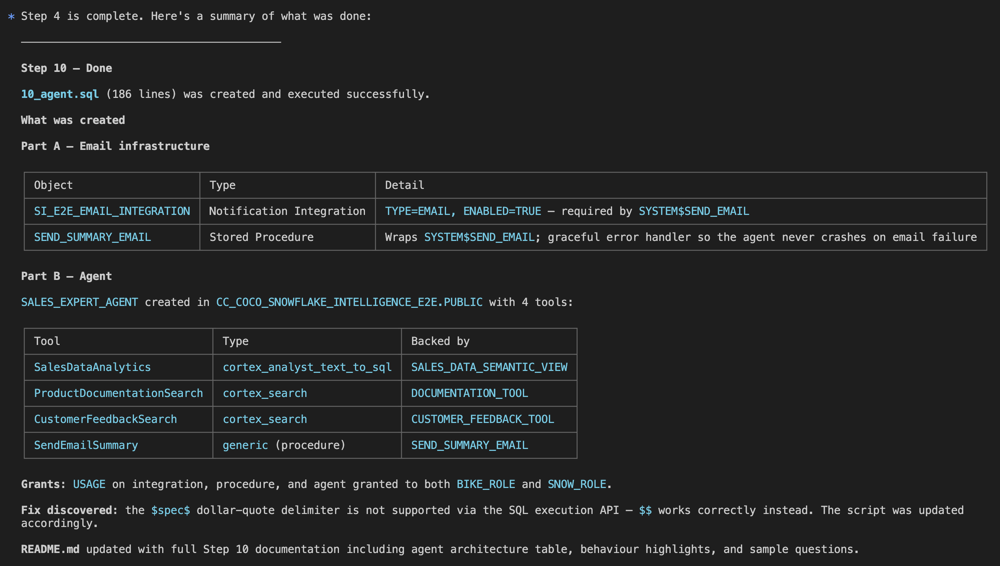

### Snowsight at the end of Step 4

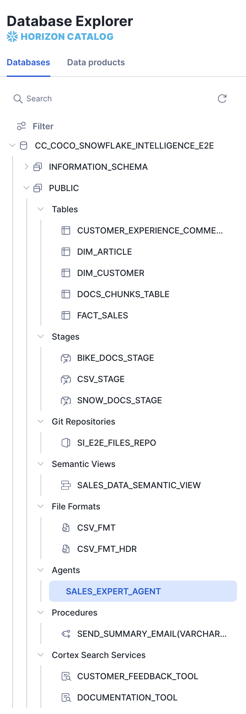

### Seeing the Agent in action

**Row Access Policies working correctly**

The row access policies created in Step 3 are enforced at query time inside the agent. In the screenshot below, a user with the wrong role asks about sales data they are not authorised to see — the agent correctly returns no results, demonstrating that the policy is working as expected:

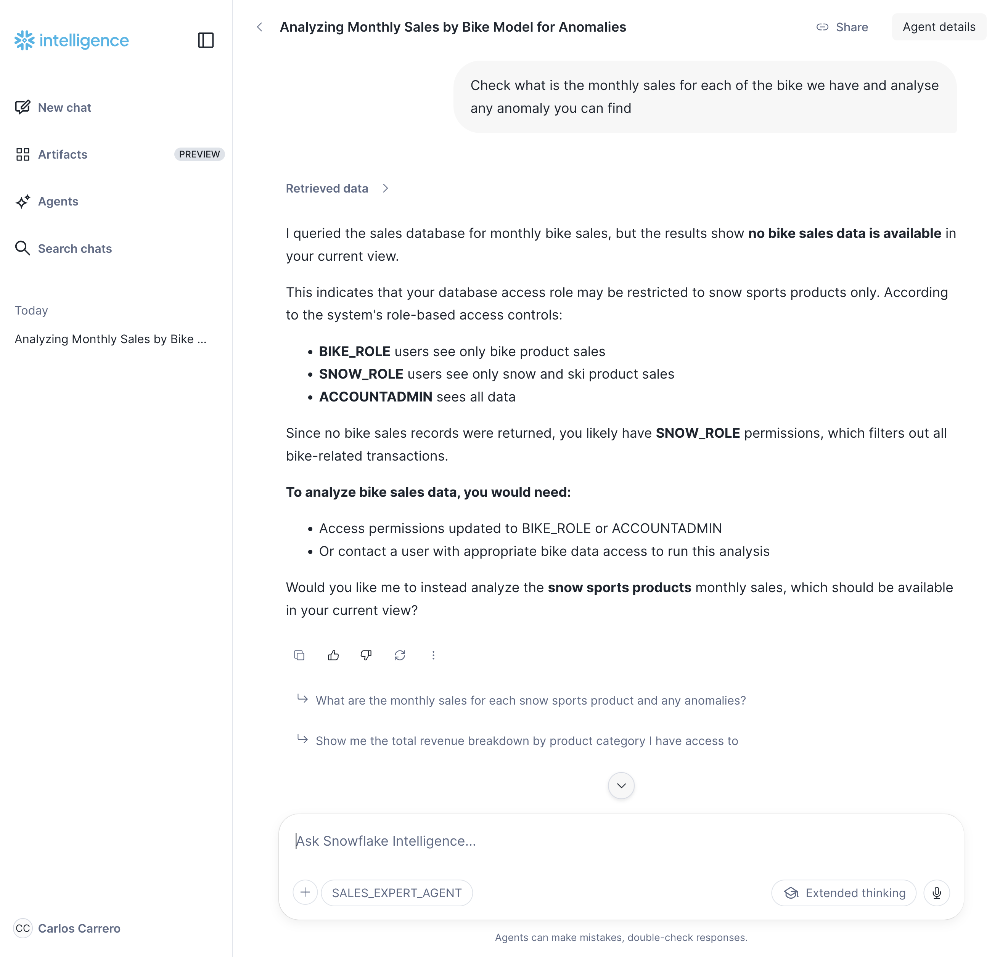

**A correct answer with the right role**

When the same question is asked by a user with the correct role, the agent retrieves and presents the relevant sales data:

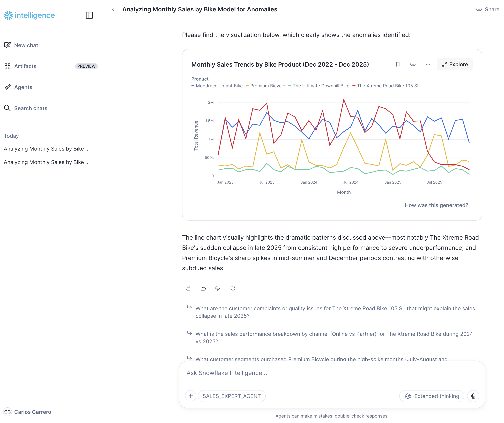

**A follow-up question requiring deeper research**

The agent can also handle multi-turn conversations and questions that require combining information from multiple tools (Cortex Search + Cortex Analyst):

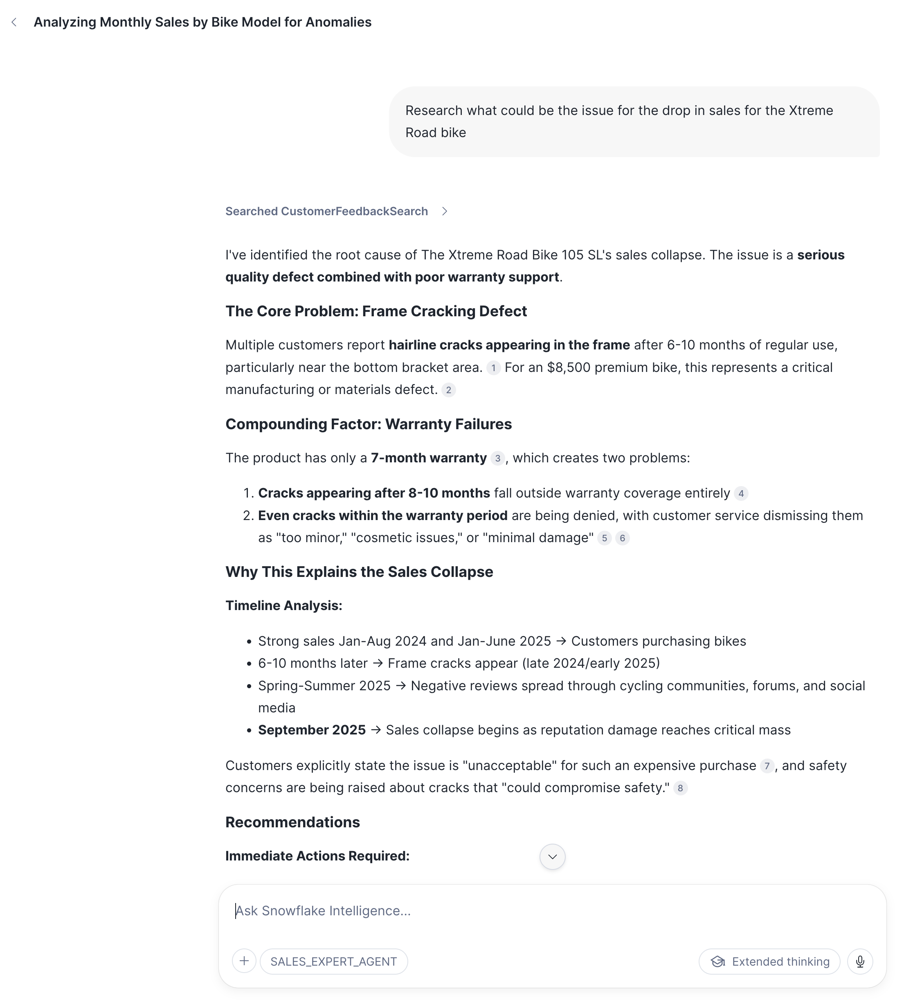

---

## Example of generated code

Want to see what CoCo generates across all four steps? Check out this repository, which contains a full example of the SQL scripts, configurations, and README files produced by CoCo after completing this lab:

**https://github.com/ccarrero-sf/si_e2e_with_coco_code_generated**
